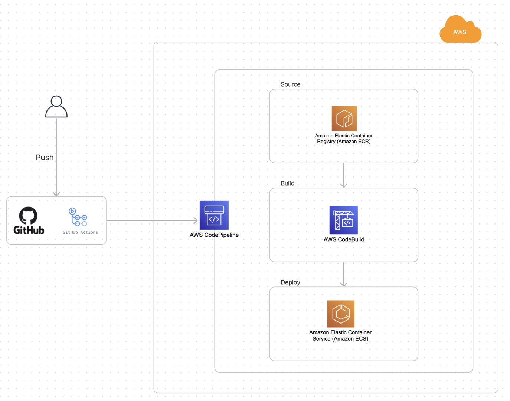

# CICD-fastapi-server

- 기술 스택
  - 
    - github-action
    - Docker
    - AWS Codepipeline
    - AWS ECR
    - AWS CodeBuild
    - AWS ECS
  
- 구현 과정
  - 
    1. github-action을 통해 dokcerfile을 build
    2. build결과물인 docker Image를 ECR에 push
    3. ECR의 변경을 감지한 Codepipeline은 CodeBuild서비스를 통해 테스트및 빌드를 수행
    4. build가 성공하면 ECS에 Deploy
- 아키텍처
  - 
    